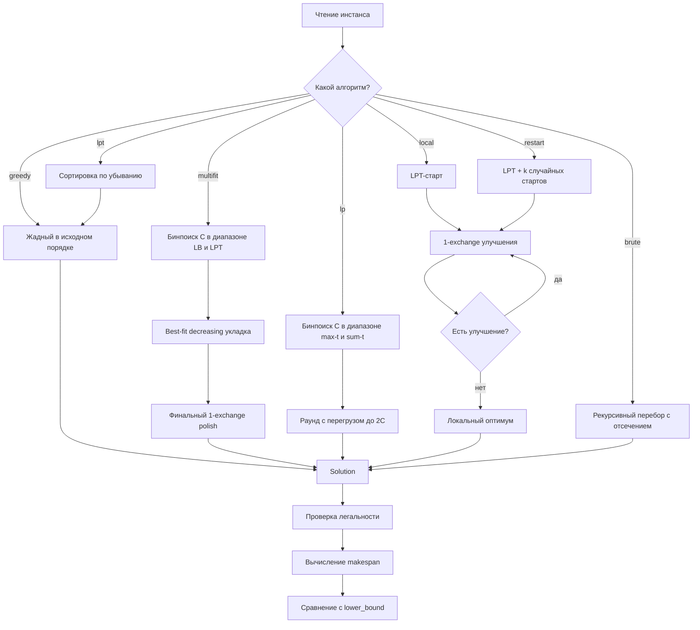
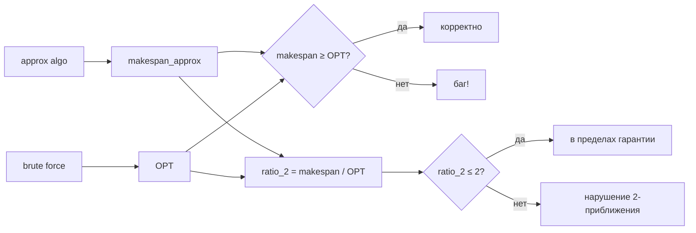
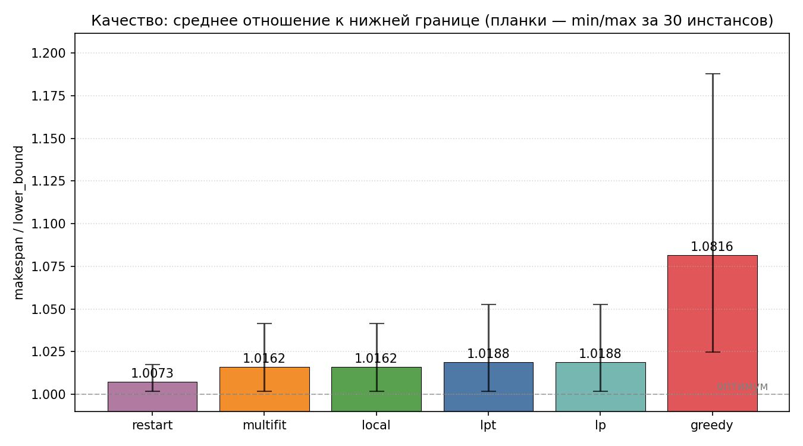
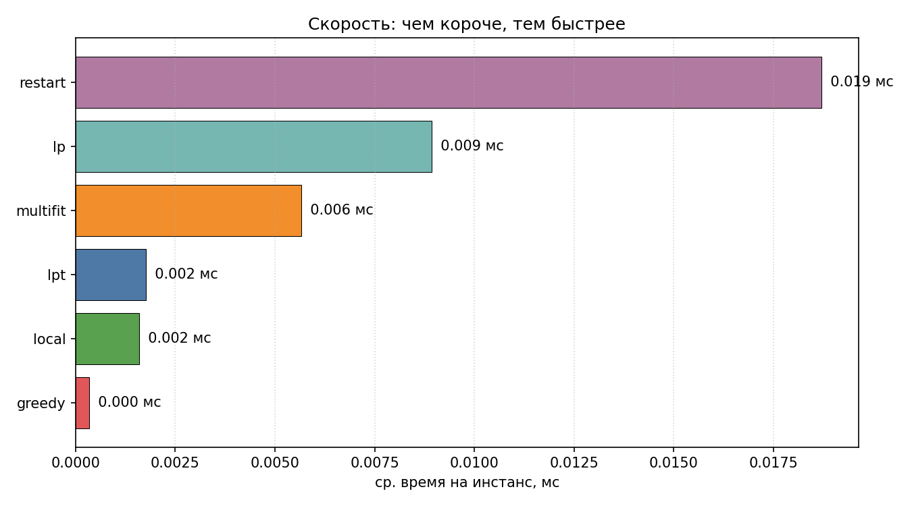
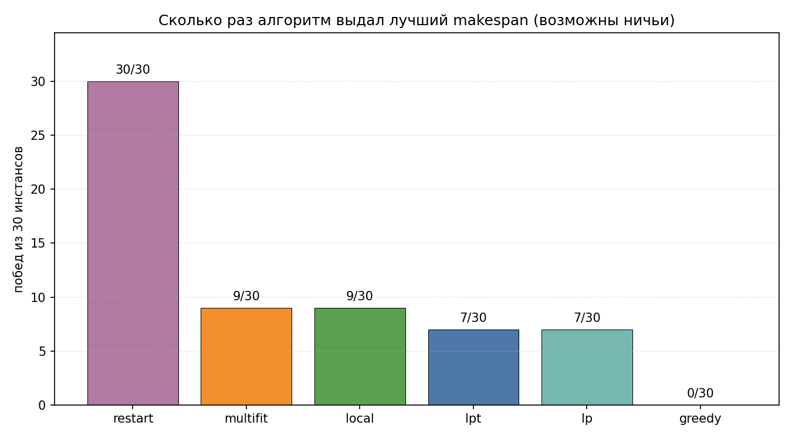
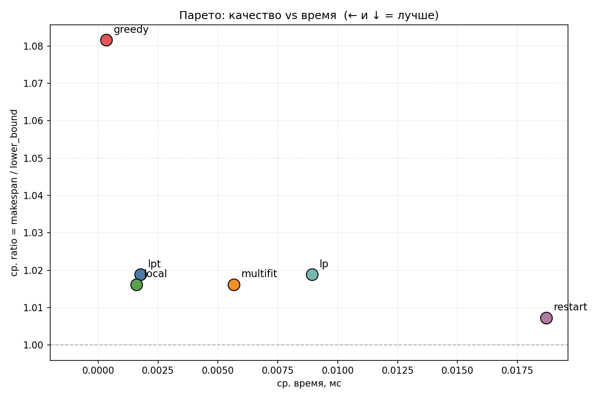
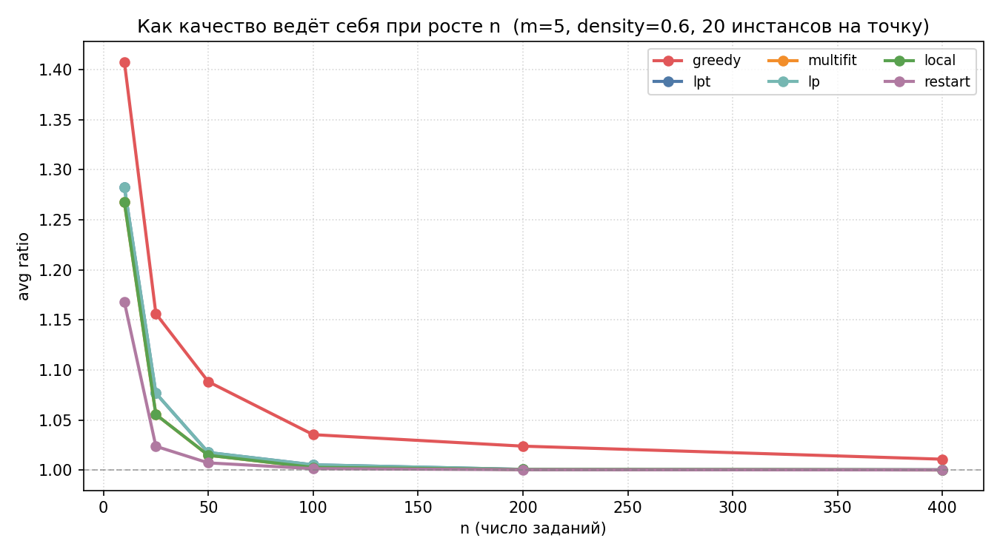

# Распределение нагрузки с ограничениями на машины

Реализация и сравнительный анализ приближённых алгоритмов для NP-трудной
задачи минимизации **makespan** при назначении заданий на машины с
ограничениями совместимости (*restricted machines scheduling*).

```
   задания                машины
   ┌───┐                  ┌─────┐
   │ 8 │──┐               │  A  │
   │ 7 │  │  ограничения  │     │
   │ 6 │──┼──── M_j ─────▶│  B  │   ──▶  C_max  (минимизировать)
   │ 5 │  │               │     │
   │ ⋮ │──┘               │  C  │
   └───┘                  └─────┘
```

---

## Содержание

- [Постановка задачи](#постановка-задачи)
- [Зачем это нужно](#зачем-это-нужно)
- [Что умеет проект](#что-умеет-проект)
- [Ключевые понятия](#ключевые-понятия)
- [Алгоритмы](#алгоритмы)
- [Поток работы алгоритма](#поток-работы-алгоритма)
- [Нижние границы](#нижние-границы)
- [Brute force и верификация](#brute-force-и-верификация)
- [Структура проекта](#структура-проекта)
- [Формат входа](#формат-входа)
- [Сборка и запуск](#сборка-и-запуск)
- [Бенчмарки и результаты](#бенчмарки-и-результаты)
- [Тестирование](#тестирование)
- [Детали реализации](#детали-реализации)
- [Известные ограничения](#известные-ограничения)
- [Литература](#литература)

---

## Постановка задачи

Машины — это абстрактные обрабатывающие устройства. Это может быть
процессор, сервер в кластере, рабочее место на конвейере, печатный станок —
что угодно, что в каждый момент времени выполняет одно задание.

Каждое задание `j` имеет размер `t[j]` и может выполняться только на своём
подмножестве машин `M_j` — например, нужная программа установлена не везде.
Нужно назначить каждое задание ровно на одну допустимую машину так, чтобы
максимальная суммарная нагрузка по машинам (**makespan**, `C_max`) была
минимальной.

### Маленький пример

```
машины: A, B
задания: t = [4, 3, 2, 1], каждое можно на любую

плохое назначение:                хорошее назначение:
   A │ 4 │ 3 │     C_max = 7         A │ 4 │ 1 │     C_max = 5
   B │ 2 │ 1 │                       B │ 3 │ 2 │
     └───┴───┘                         └───┴───┘
     0   4   7                         0   4   5
```

### Формальная запись

Найти массив назначения `assign[0..n-1]`, где `assign[j] ∈ M_j`, минимизирующий

```
C_max = max_{i = 0..m-1}  Σ_{j : assign[j] == i}  t[j]
```

Задача NP-трудная: количество легальных назначений
`|M_0| · |M_1| · … · |M_{n-1}|` экспоненциально растёт с `n`.

---

## Зачем это нужно

Restricted machines scheduling — это общая модель, к которой сводятся
реальные задачи:

- распределение задач по машинам в кластере, где не каждая машина имеет
  нужный софт/железо/доступ к данным
- планирование производственных операций, где деталь подходит не каждому станку
- размещение запросов между серверами с учётом quota и совместимости
- shift scheduling: смены, на которые подходят не все сотрудники

Для всех этих задач известно, что точный оптимум искать дорого, но
существуют приближённые алгоритмы с теоретическими гарантиями, которые
выдают решения **не хуже чем в 2 раза** от оптимума за полиномиальное время.

---

## Что умеет проект

- читает инстансы из текстового файла
- генерирует случайные инстансы с настраиваемой плотностью совместимости
- запускает **6 алгоритмов** (greedy, LPT, Multifit, LP-style, local search, restart)
- считает **3 нижние границы** на оптимум
- проверяет легальность каждого назначения
- находит точный оптимум перебором с отсечением для маленьких инстансов
- бенчмаркит один инстанс с детальной таблицей и временем
- запускает пакетный бенчмарк на N случайных инстансах с агрегированной статистикой
- умеет печатать таблицу результатов в CSV

---

## Ключевые понятия

### Машина (Machine)

Абстрактное обрабатывающее устройство. В каждый момент времени машина
обрабатывает **одно** задание. После завершения переходит к следующему.

### Задание (Job)

Единица работы с положительным размером `t[j]` и непустым множеством
**допустимых** машин `M_j`.

### Назначение (Assignment)

Функция `assign: J → M`, такая что `assign[j] ∈ M_j` для всех `j`.

### Нагрузка машины (Load)

```
load[i] = Σ_{j : assign[j] == i}  t[j]
```

### Makespan (C_max)

Финальное время самой загруженной машины:

```
C_max(assign) = max_i load[i]
```

### Нижняя граница (Lower Bound)

Любое число, гарантированно ≤ оптимуму. Используется для оценки качества
приближённого решения. В проекте берётся максимум из трёх:

- `max t[j]` — одно задание не может закончиться раньше своей длительности
- `⌈Σ t / m⌉` — даже идеальное равномерное деление требует столько
- forced load — задания с `|M_j| = 1` обязаны идти на свою единственную машину

### Коэффициент аппроксимации (Approximation Ratio)

```
ratio = makespan / lower_bound
```

Чем ближе к 1.00 — тем лучше. Для LPT и Multifit на restricted assignment
доказано, что `ratio ≤ 2` (теорема Lenstra–Shmoys–Tardos).

### Brute Force (точный оптимум)

Полный перебор всех легальных назначений рекурсивно с отсечением
(branch-and-bound). Гарантирует точный оптимум, но работает только для
маленьких `n` (≤ 14).

---

## Алгоритмы

Сводная таблица:

| Алгоритм   | Идея                                                   | Гарантия                            | Сложность           |
|------------|--------------------------------------------------------|-------------------------------------|---------------------|
| `greedy`   | в исходном порядке, на самую свободную допустимую      | не ограничена                       | O(n · m)            |
| `lpt`      | сортировка по убыванию `t[j]`, потом greedy            | 2-приближение                       | O(n log n + n · m)  |
| `multifit` | бинпоиск по `C` (между LB и LPT) + полировка local search | 2-приближение, эмпирически лучше LPT | O(n log n · log Σt) |
| `lp`       | бинпоиск по `C` + раунд с перегрузом ≤ 2C              | 2-приближение (Shmoys–Tardos style) | O(n log n · log Σt) |
| `local`    | LPT-старт + 1-exchange улучшения                       | локальный оптимум                   | O(итер · n · m²)    |
| `restart`  | LPT-старт + несколько случайных стартов, лучший из них | локальный оптимум, эмпирически лучше| O(restarts · n · m²)|
| `brute`    | DFS-перебор с отсечением, точный оптимум               | оптимум                             | экспоненциальная    |

### Greedy (простой жадный)

Идёт по заданиям в исходном порядке (0..n-1). Каждое задание ставит на
**самую свободную** машину из его `M_j`.

Плюсы: тривиален, O(n·m).
Минусы: качество зависит от порядка ввода, гарантии для restricted нет.

### LPT (Largest Processing Time)

Сначала сортирует задания по **убыванию размера**, потом применяет жадный
шаг. Большие задания распределяются первыми — это критично, потому что
маленькие потом можно легко «дополнить» по краям.

```
размеры:  8  7  6  5  4  3  2  1
порядок:  ↓  ↓  ↓  ↓  ↓  ↓  ↓  ↓
         M_a M_b M_a M_c M_a M_b M_b M_c   ← на каждом шаге выбираем
                                              самую свободную из M_j
```

Теорема Graham (1969): для unrestricted случая LPT — это **4/3 - 1/(3m)** -
приближение. Для restricted доказана граница **2**.

### Multifit

Идея: вместо того чтобы строить расписание напрямую, выбираем «целевое»
значение makespan `C`, проверяем — можно ли все задания **уложить** в этот
бюджет на машинах с учётом `M_j`. Если можно — пробуем уменьшить `C`,
если нет — увеличиваем. Бинпоиск по `C`.

```
        feasible?
hi ──────────●─────  ← LPT-makespan (заведомо достижимо)
            ╱
           ●
          ╱  пытаемся
         ●   сузить
        ╱
lo ────●─────────────  ← max(LB) — лучшая нижняя граница
```

Реализация в этом проекте использует два усиления над «учебной» версией:

1. **Верхняя граница = LPT-makespan, нижняя = lower_bound_best**. Это
   сокращает количество итераций бинпоиска (вместо `[max t, Σ t]` берём
   гораздо более тугой интервал) и гарантирует что найденное решение
   не хуже LPT.
2. **Финальный 1-exchange polish** поверх найденного решения. Часто
   срезает ещё ~0.5–1% сверху и переводит Multifit в лигу с local search.

На бенче (см. ниже) эти две правки сдвигают Multifit с `ratio = 1.0188` до
`ratio = 1.0162` — на уровень `local`.

### LP-style (упрощённый Shmoys–Tardos)

То же что Multifit, но разрешает раунд с **перегрузом до 2C**. Это даёт
теорему: если ОПТИМУМ = `C*`, то алгоритм гарантированно находит расписание
с makespan ≤ `2 · C*`. Это и есть 2-приближение Shmoys–Tardos в упрощённой
форме (без явного решения LP-релаксации).

### Local Search (1-exchange)

Берёт стартовое решение (от LPT) и пытается **переставить каждое задание**
на другую допустимую машину. Если перестановка уменьшает makespan —
выполняет её. Повторяет, пока есть улучшения.

```
до:  A │ 4 │ 1 │      C_max = 5
     B │ 3 │ 3 │
     C │ 4 │             ← пробуем 4 → A? нет, A полная
                         ← пробуем 4 → B? нет, B полная
                         ← пробуем 4 → C? оно уже там
                  (нет улучшений → локальный оптимум)
```

### Local Search с рестартами

Тот же 1-exchange, но запускается с **нескольких начальных точек**: один
старт от LPT (детерминированный) и `k-1` стартов от случайных легальных
назначений. Возвращает лучший найденный makespan.

Эмпирически побеждает все остальные алгоритмы на тестируемых параметрах.

### Brute Force

Рекурсивный перебор `M_0 × M_1 × … × M_{n-1}` с отсечением: если текущий
максимум уже ≥ лучшего найденного makespan, ветка отбрасывается. Дает
**точный оптимум**, но работает только для `n ≤ 14`. Используется как
эталон для проверки качества приближённых алгоритмов в тестах.

---

## Поток работы алгоритма



---

## Нижние границы

Любая нижняя граница даёт сертификат качества: если получили `makespan = 540`
и нижняя граница `535`, то даже теоретический оптимум не лучше чем `535`,
значит наше решение хуже оптимума максимум на ~1%.

### 1. `max t[j]`

```
LB_1 = max_j  t[j]
```

Тривиально: ни одно расписание не может закончиться раньше, чем закончится
самое длинное задание (оно идёт на одной машине целиком).

### 2. Средняя нагрузка

```
LB_2 = ⌈Σ t / m⌉
```

Если бы мы могли разделить общую работу идеально равномерно между всеми
`m` машинами — получили бы ровно эту величину. Реально достичь её редко
удаётся из-за неделимости заданий и ограничений `M_j`.

### 3. Forced load

```
LB_3 = max_i  Σ_{j : M_j = {i}}  t[j]
```

Задания, у которых множество допустимых машин состоит ровно из одной
машины, **обязаны** идти на неё. Сумма таких заданий на одной машине — это
гарантированная нагрузка независимо от того, как мы распределяем
остальные задания.

### Итоговая граница

```
LB = max(LB_1, LB_2, LB_3)
```

В тестах проект проверяет, что **makespan каждого** алгоритма ≥ `LB` (если
нет — это баг в реализации).

---

## Brute force и верификация



Файл `tests/test_brute.c` прогоняет brute force на 20 случайных инстансах
размером 3×8 (за миллисекунды) и проверяет:

1. **Все приближённые ≥ OPT** — иначе brute либо приближённые неправильны
2. **LPT ≤ 2·OPT на всех** — проверка теоретической гарантии
3. **Restart ≤ LPT** — рестарты не должны ухудшать

В текущей версии проходит **20/20** случаев.

---

## Структура проекта

```
.
├── include/
│   └── ld.h                  — заголовок: типы Instance/Solution и прототипы
├── src/
│   ├── ld.c                  — реализация всех алгоритмов
│   ├── main.c                — CLI: ./loadbalance <input> [algo]
│   ├── generator.c           — генератор случайных инстансов
│   ├── bench.c               — однопрогонный бенч
│   └── bench_batch.c         — пакетный бенч на N инстансов
├── tests/
│   ├── test_ld.c             — базовые unit-тесты, граничные случаи
│   ├── test_random.c         — инварианты на 125 случайных инстансах
│   └── test_brute.c          — приближённые vs точный оптимум
├── data/
│   ├── sample.txt            — 3 машины × 7 заданий
│   ├── tight.txt             — пример с принудительными назначениями
│   ├── hard.txt              — 4 × 12 с разными плотностями
│   └── single.txt            — одна машина (тривиальный случай)
├── Makefile
└── README.md
```

---

## Формат входа

```
m n
t_0 k_0 a_0_0 a_0_1 ... a_0_{k_0-1}
t_1 k_1 a_1_0 ...
...
t_{n-1} k_{n-1} ...
```

- `m` — число машин
- `n` — число заданий
- `t_j` — положительный размер задания `j`
- `k_j` — число допустимых машин для задания `j`
- `a_j_*` — индексы допустимых машин (каждый ∈ `[0, m-1]`)

Пример (`data/sample.txt`):

```
3 7
8 3 0 1 2
7 3 0 1 2
6 2 0 1
5 3 0 1 2
4 2 1 2
3 3 0 1 2
2 2 0 2
```

Читается: 3 машины, 7 заданий. Первое задание имеет размер 8 и может
выполняться на любой из машин {0, 1, 2}. Третье — размер 6, только на
{0, 1}.

---

## Сборка и запуск

### Цели Makefile

```bash
make             # собирает loadbalance + gen + bench + bench_batch
make test        # базовые unit-тесты
make test-all    # базовые + рандомизированные + brute-force тесты
make run         # ./bin/loadbalance data/sample.txt all
make bench       # генерит инстанс и прогоняет однопрогонный бенч
make bench-batch # пакетный бенч на 30 случайных инстансов
make clean
```

### Бинарь loadbalance

```
./bin/loadbalance <input> [greedy|lpt|multifit|lp|local|all]
```

Примеры:

```bash
./bin/loadbalance data/sample.txt all
./bin/loadbalance data/hard.txt lpt
./bin/loadbalance data/tight.txt multifit
```

### Генератор инстансов

```
./bin/gen <m> <n> <tmin> <tmax> <density> [seed]
```

- `density` — вероятность включения каждой машины в `M_j` (0 < d ≤ 1)
- `seed` — опциональный, по умолчанию `time(NULL)`

```bash
./bin/gen 5 50 1 100 0.6 42 > my_instance.txt
```

### Однопрогонный бенч

```
./bin/bench <input> [--csv]
```

Прогоняет все 6 алгоритмов на одном инстансе, печатает таблицу со
временем и отношением к нижней границе. Флаг `--csv` — машиночитаемый
формат.

### Пакетный бенч

```
./bin/bench_batch <m> <n> <tmin> <tmax> <density> <runs> [--csv]
```

Генерит `runs` случайных инстансов, прогоняет все алгоритмы на каждом,
печатает средний/мин/макс ratio, среднее время, количество побед.
Флаг `--csv` выдаёт результат в машиночитаемом формате.

### Регенерация графиков

```bash
python3 -m venv .venv
.venv/bin/pip install matplotlib
.venv/bin/python scripts/plot_bench.py
```

Скрипт прогоняет несколько конфигураций бенча и пересохраняет PNG-картинки
в `images/`.

---

## Бенчмарки и результаты

### Один инстанс (`m = 5, n = 50, t ∈ [1, 100], density = 0.6, seed = 42`)

```
algo           makespan  lower_bound    ratio    time_ms  legal
greedy              592          535   1.1065      0.002    yes
lpt                 540          535   1.0093      0.013    yes
multifit            540          535   1.0093      0.028    yes
lp                  540          535   1.0093      0.059    yes
local               540          535   1.0093      0.008    yes
```

На этом конкретном инстансе все пять алгоритмов кроме `greedy` сошлись в
одно и то же решение, отличающееся от нижней границы менее чем на 1%.
Полный «букет» различий виден на батч-прогоне ниже.

### Пакет из 30 случайных инстансов

```
algo       avg_ratio  min     max     avg_ms    wins
greedy        1.0816  1.0247  1.1877   0.001     0/30
lpt           1.0188  1.0020  1.0528   0.003     7/30
multifit      1.0162  1.0020  1.0417   0.007     9/30
lp            1.0188  1.0020  1.0528   0.012     7/30
local         1.0162  1.0020  1.0417   0.002     9/30
restart       1.0073  1.0019  1.0174   0.025    30/30
```

### Качество — среднее отношение к нижней границе (чем ближе к 1.000, тем лучше)



Планки показывают min/max за 30 инстансов. `restart` стабильно лежит ~0.7% выше
оптимума, `greedy` плавает в диапазоне 2.5%–18.8%.

### Время выполнения (среднее, мс)



### Победы — сколько раз алгоритм выдал лучший makespan



`restart` выигрывает все 30 инстансов. Остальные «делят» оставшиеся места.

### Парето: качество vs время



Чем левее и ниже — тем лучше (быстро **и** точно). На фронте сидят
`lpt` (быстро), `local` (быстро + лучшее качество среди дешёвых),
`multifit` (то же качество что `local`, чуть медленнее за счёт бинпоиска)
и `restart` (лучшее качество, но в ~10× медленнее).
Алгоритм `lp` доминируется `lpt`: то же качество, но в 4× дольше работает.

### Как качество ведёт себя при росте n



При `n ≥ 100` все алгоритмы (кроме чистого `greedy`) практически сходятся к
оптимуму: коэффициент аппроксимации становится близок к 1.00. На маленьких
инстансах разница между алгоритмами особенно заметна.

### Выводы

1. **Greedy без сортировки даёт стабильное отклонение ~8%** — простая
   сортировка по убыванию (LPT) практически нивелирует разрыв
2. **Multifit с финальным local-polish обгоняет LPT** (1.0162 vs 1.0188)
   и идёт вничью с чистым `local`
3. **LP без полировки даёт то же качество что LPT** — теоретическая
   гарантия 2-приближения не превращается в эмпирический выигрыш на
   обычных инстансах
4. **Restart выигрывает 30/30 инстансов** благодаря множеству стартов,
   но платит ~10× времени по сравнению с LPT

---

## Тестирование

### `make test` — базовые юнит-тесты (`tests/test_ld.c`)

- одна машина: все задания идут на неё
- две машины, симметричный случай: LPT даёт оптимум
- ограничение `M_j`: жадный уважает разрешённые машины
- инфизибельность: нет допустимой машины → ошибка
- локальный поиск монотонен: makespan не ухудшается
- Multifit ≥ LPT

### `make test-all` дополнительно прогоняет:

**`tests/test_random.c`** — 125 комбинаций алгоритм × случайный инстанс:

- 5 шаблонов инстансов × 5 сидов × 5 алгоритмов
- проверяется легальность каждого решения
- проверяется `makespan ≥ lower_bound`
- проверяется отношение для LPT в безограниченном случае (`ratio ≤ 1.5`)

**`tests/test_brute.c`** — приближённые против точного оптимума:

- brute force на одной машине: единственное возможное `makespan = Σt`
- brute force даёт легальное решение
- LPT не хуже greedy
- все приближённые `≥ OPT` на 15 случайных инстансах
- LPT ≤ 2·OPT на 20 случайных инстансах
- restart ≤ local на 10 случайных инстансах

Всего проходит **15 тестов** (6 базовых + 3 рандомизированных + 6 brute-force)
с агрегированными проверками 125 + 20 + 15 + 10 = **170+ микро-кейсов**.

---

## Детали реализации

- размеры заданий — `long`, чтобы суммарная нагрузка не переполнилась
- LPT и Multifit сортируют не сами задания, а массив **индексов**, чтобы
  не копировать структуры
- бинпоиск Multifit идёт на `[lower_bound_best, LPT-makespan]` (туже, чем
  «учебный» `[max t, Σ t]`), и сходится за ≤ 40 итераций для целочисленных
  размеров. После бинпоиска применяется финальный 1-exchange polish
- LP-style сохраняет «учебный» интервал `[max t, Σ t]` и допускает раунд
  с перегрузом ≤ 2C, чтобы соответствовать теореме Shmoys–Tardos
- локальный поиск пересчитывает новый makespan за `O(m)` на каждую
  кандидат-перестановку: общая сложность `O(итер · n · m²)`
- brute force отсекает ветку, как только текущий максимум достигает
  лучшего найденного — это превращает теоретически экспоненциальный
  алгоритм в практичный для `n ≤ 14`
- генератор гарантирует ≥ 1 допустимую машину для каждого задания
  даже при очень низкой плотности (через резервный `rand() % m`)
- проверка ошибок: каждый `malloc`/`calloc` проверяется, при неудаче
  освобождается всё ранее выделенное; в каждой ветке вызываются
  `solution_free` / `instance_free`

---

## Известные ограничения

- brute force на инстансах `n > 14` отказывается работать (с понятной ошибкой) —
  это сознательное ограничение для безопасности
- LP-style — упрощённая Shmoys–Tardos без явного решения LP симплекс-методом;
  полная версия требует LP-солвера, что выходит за рамки задачи
- генератор инстансов использует стандартный `rand()` — для серьёзной
  статистики стоит заменить на `xorshift` или `pcg32`
- однопроцессная реализация: при многотысячных `n` имеет смысл распараллелить
  локальный поиск (каждый рестарт — независимый поток)

---

## Литература

1. **Lenstra J. K., Shmoys D. B., Tardos É.** Approximation algorithms for
   scheduling unrelated parallel machines // Mathematical Programming. —
   1990. — Т. 46. — №. 1. — С. 259–271.
2. **Shmoys D. B., Tardos É.** An approximation algorithm for the
   generalized assignment problem // Mathematical Programming. — 1993. —
   Т. 62. — №. 1. — С. 461–474.
3. **Hochbaum D. S., Shmoys D. B.** Using dual approximation algorithms
   for scheduling problems theoretical and practical results //
   Journal of the ACM. — 1987. — Т. 34. — №. 1. — С. 144–162.
4. **Graham R. L.** Bounds on multiprocessing timing anomalies //
   SIAM Journal on Applied Mathematics. — 1969. — Т. 17. — №. 2. — С. 416–429.
5. **Williamson D. P., Shmoys D. B.** The design of approximation
   algorithms. — Cambridge University Press, 2011.
